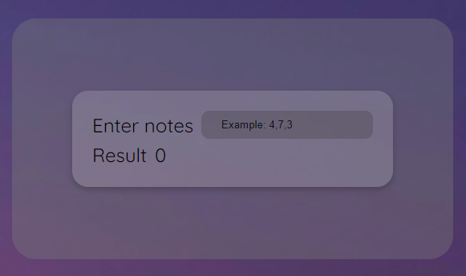

# 🧮 Calculadora de promedios 🧮

## 📜 Sobre el proyecto 

El proyecto Average Grades Calculator es una aplicación web sencilla que permite a los usuarios ingresar un conjunto de notas y calcular su promedio automáticamente. La interfaz está diseñada con HTML y CSS, mientras que la lógica de la calculadora está implementada en JavaScript.

## 🛠️ Stack 

   

## 📋 Funcionalidades 

+ Interfaz amigable: una pantalla estetica y fácil de usar para ingresar las notas.

+ Validación de entrada: solo se permiten números y separadores de coma.
+ Cálculo en tiempo real: el promedio se muestra automáticamente al ingresar las notas.

## ⚙️ Funcionamiento del script

El archivo calculadora.js contiene una función principal calculateAverage() que se ejecuta cada vez que el usuario ingresa texto en el campo de entrada. La función realiza las siguientes tareas:

1. Filtra caracteres inválidos para asegurar que solo se procesen números y comas.
2. Convierte la entrada en un array de números.
3. Calcula la suma y el promedio de las notas.
4. Muestra el resultado en la página.

## 💻 ¿Quieres comprobar esta función? 

- [Prueba la función aquí](https://abrahamgalvezv.github.io/Calculate_Average/)
- Clona este repositorio en tu equipo
- ¡Implementa esta función en tu proyecto! 

## 📭 Contacto 

 

